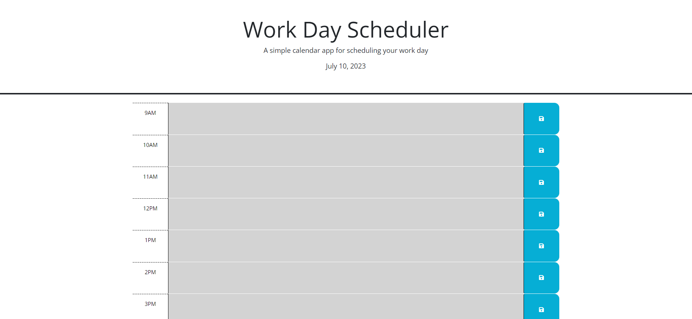
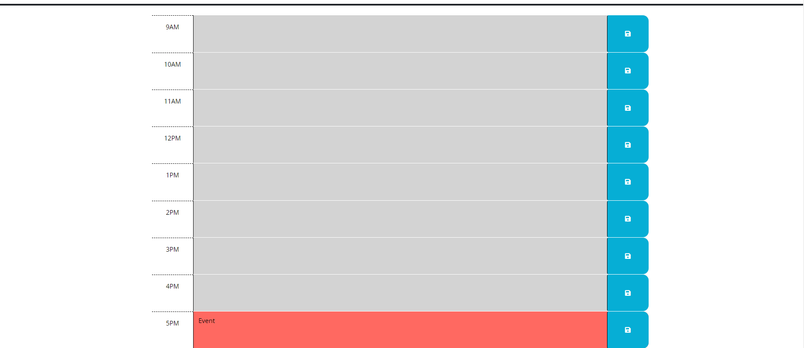

# 05 Third-Party APIs: Work Day Scheduler

## Description

https://aepermanis.github.io/Daily-Planner/

# User Story

```md
AS AN employee with a busy schedule
I WANT to add important events to a daily planner
SO THAT I can manage my time effectively
```


# Acceptance Criteria

```md
GIVEN I am using a daily planner to create a schedule
WHEN I open the planner
THEN the current day is displayed at the top of the calendar
WHEN I scroll down
THEN I am presented with timeblocks for standard business hours of 9am to 5pm
WHEN I view the timeblocks for that day
THEN each timeblock is color coded to indicate whether it is in the past, present, or future
WHEN I click into a timeblock
THEN I can enter an event
WHEN I click the save button for that timeblock
THEN the text for that event is saved in local storage
WHEN I refresh the page
THEN the saved events persist
```
# Screenshot





## Sources 

https://www.freecodecamp.org/news/break-in-python-nested-for-loop-break-if-condition-met-example/#:~:text=In%20situations%20where%20we%20want,to%20%22break%22%20the%20loop.

https://day.js.org/docs/en/display/format

https://stackoverflow.com/questions/12327883/how-can-i-save-the-contents-of-a-textarea-as-a-variable-using-javascript-in-an-e

https://stackoverflow.com/questions/507138/how-to-add-a-class-to-a-given-element

https://developer.mozilla.org/en-US/docs/Web/HTML/Element/textarea

